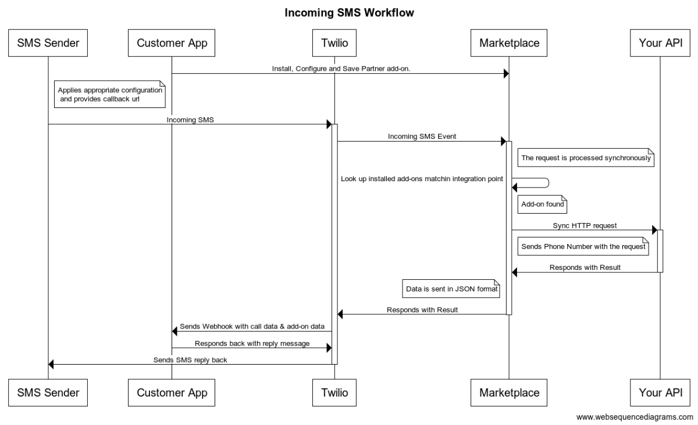

# Incoming SMS Example

This example demonstrates creating a Twilio Marketplace add-on for `incoming SMS` integration point.

The `incoming sms` integration point allows developers to receive phone number attached to a SMS when an incoming SMS arrives to Twilio to return data attached to the phone number that can be used by Twilio customer to process the message.

### Headers

Twilio will always pass the following set of headers along with the  request to your API that may be used for security and debugging purposes.

| Header Name | Value |
|---|---|
| X-Twilio-AddOnVersionSid | The unique identifier of the Add-on version being used by the developer.  Use it to identify if the developer is using an older version of your Add-on  |
| X-Twilio-AccountSid | The Account Sid of your (?or the developer's?) Twilio Project.  Example : AC05b3911315a1322d1dede66eed740000 |
| X-Twilio-Signature | The signature of this request, signed by your Twilio Project, and used to verify the request came from Twilio unmodified. See the “Validating Requests are coming from Twilio” section here for details of signature algorithm : https://www.twilio.com/docs/api/security  Example : 0FqS203W44/lM2UEM+51hRzwat4= |
| X-Twilio-RequestSid | The unique identifier for this request.  Used for billing and debugging.  Example : MR000009775bb6d43d1cabc4955723fae1 |
| X-Twilio-AddOnSid | The unique identifier for the Add-on being invoked. Use this to identify which of your Add-ons is generating this request. |
| X-Twilio-AddOnInstallSid | The unique identifier for a developers install of an Add-on. Use this to distinguish between developers using this particular Add-on. |

### Add-on Request Fields

When the Add-on is called, Twilio passes the following fields to your API.

| Field      | Description                                        |
|------------|----------------------------------------------------|
| Phone      | Phone number to lookup into your database to return data associated. |

?How are they passed? JSON? UrlEncoded Form parameters in the body? POST? GET?

### Your API Response Requirements

Both success and error responses are expected to be in a standard JSON object format.  The server is expected to return a 2xx response for all requests, even error requests. This is to disambiguate your API errors that may affect SLA from legitimately rejected requests due to misconfiguration or other.  For successfully synchronous Add-on requests, a 200 OK response is expected, with a Content-Type header of `application/json` and a JSON object returned in the body.  For successful asynchronous Add-on requests, a 202 Accepted response is expected, with no body returned.

For both sync and async cases error cases, a 200 OK is expected with a Content-Type header of `application/json` and a JSON object describing the error condition.  

Any 4xx or 5xx errors returned will be considered your add-on misconfiguration or outage, will be logged in the error reporting system and will count against your SLA.  For 4xx errors, Twilio will fail the request immediately.  For 5xx errors, Twilio will retry up to N times, or until the TTL has passed. You should expect retries, using the request_sid as an [idempotency](https://en.wikipedia.org/wiki/Idempotence) token.

For async requests, you are responsible for POSTing back the JSON object body to Twilio (?where?) once the async task is completed.  This JSON body will be the same format as above, for both success or failure.

### SLA

Because this request is returned asynchronously, there are no hard requirements.  A service exposing this is recommended to return in a median time of 3x audio duration and a 99% under 5x audio duration.  Any request taking longer than 10x duration will be failed by Twilio, an error payload will be sent, and the developer will not be billed (?What does "3x audio duration"? or "5x audio duration" mean?)

### Response Size Limit

As an asynchronous Add-on, the response for this is limited to a maximum of 100 MB. Any response larger than this maximum will be failed by Twilio, an error payload will be sent, and the developer will not be billed.

### Workflow

The following is a high-level workflow that returns on how the `incoming SMS` add-on expected to work.

## Installation

**Requires Node >= v12.1.0**

Run `npm install`

npm dependencies (contained in the `package.json`):

* dotenv
* express

#### Running the server

Start with `npm start` (Runs on port 8080)

Test with `npm test`

## Setup

1. Create environment file `cp .env.example .env`
2. Update ACCOUNT_SID and AUTH_TOKEN, you can retrieve your Twilio credentials using Twilio console, https://www.twilio.com/console/project/settings

(?How do you test this?)

## Security & Privacy Requirements

It is important to secure communication between Twilio and your api. Because you are opening up an HTTP endpoint to the public internet, all efforts should be made to make certain that endpoint does not expose you to fraud or attack. To ensure this, a number of mechanisms will be in place.

1. Twilio only supports HTTPS/TLSv1.2 (?or greater?).
2. To help mitigate any DDOS attack exposure, Twilio requests can be setup to only come from specific IPs. Twilio will contact you before adding any IPs to this range. If you require such a setup, let us know. The default behavior is that they will not come from specific IPs.

	>174.129.222.33

	>174.129.222.200

	>184.73.170.150

	>23.21.226.67
	(?maybe we shouldn't list these here, since it requires manual negotion - I might argue we don't even encourage this?)

3. Twilio signs every request with the your shared secret. You are strongly encouraged to validate the signature of the requests they receive to confirm they're coming from their Twilio account.
4. Twilio sends a unique request SID with each invocation. You are encouraged to treat this as an idempotency token, allowing them to thwart replay attacks.
5. Twilio also sends an invocation date (UTC) and TTL as part of each signed payload.  Checking this TTL (with a reasonable accommodation for clock-skew) allows you to thwart replay attack.

## ToDo
