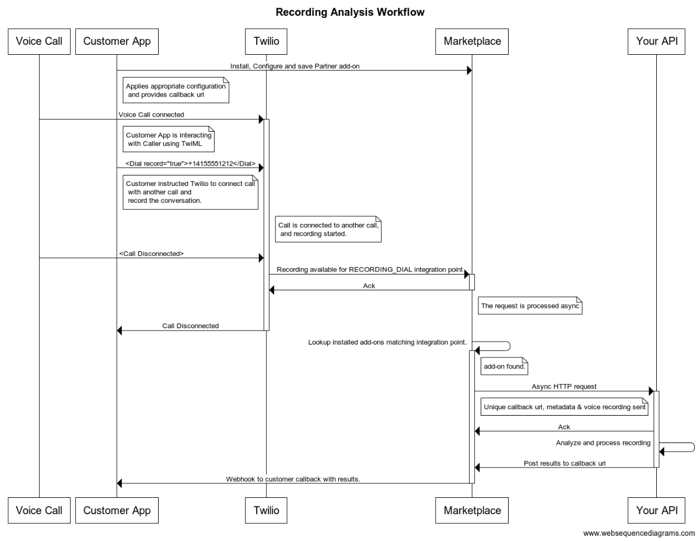

# Recording Analysis Example

This example demonstrates creating a Twilio Marketplace add-on for recording analysis integration point. 

The Recording Analysis Integration point allows developers to receive voice recordings once the recording is available for the purposes of transcribing, extracting intent, sentiment analysis or PCI redaction. While installing a recording analysis add-on, customers have the option to select one of the following integration points:

| Integration Point Name         | Integration Key      | Description                                                                                                                                                                                                                       |
|--------------------------------|----------------------|-----------------------------------------------------------------------------------------------------------------------------------------------------------------------------------------------------------------------------------|
| Record Verb Recordings         | RECORDING_VERB       | Recording created using [TwiML <Record> Verb](https://www.twilio.com/docs/voice/twiml/record)                                                                                                                                     |
| Outgoing Call (API) Recordings | RECORDING_API        | Recording for an outbound call created using [REST API](https://www.twilio.com/docs/voice/api/call-resource#create-a-call-resource)                                                                                               |
| Conference Recordings          | RECORDING_CONFERENCE | Recording created using [TwiML <Conference> Noun](https://www.twilio.com/docs/voice/twiml/conference#record) or [Conference REST API](https://www.twilio.com/docs/voice/api/conference-participant-resource#create-a-participant) |
| Dial Verb Recordings           | RECORDING_DIAL       | Recording created using [TwiML <Dial> Verb](https://www.twilio.com/docs/voice/twiml/dial#record)                                                                                                                                  |

### Workflow

The following is a high-level workflow on how the recording analysis add-on works

### Headers

Twilio will always pass the following set of headers along with the POST request to the Partner API that may be used for security and debugging purposes if the partner so desires.

| Header Name | Value |
|---|---|
| X-Twilio-AddOnVersionSid | The unique identifier of the Add-on version being used by the developer.  Use it to identify if the developer is using an older version of your Add-on  |
| X-Twilio-AccountSid | The Account Sid of the partner (your) account.  Example : AC05b3911315a1322d1dede66eed740000 |
| X-Twilio-Signature | The signature of this request, signed by the partner’s account, and used to verify the request came from Twilio unmodified. See the “Validating Requests are coming from Twilio” section here for details of signature algorithm : https://www.twilio.com/docs/api/security  Example : 0FqS203W44/lM2UEM+51hRzwat4= |
| X-Twilio-RequestSid | The unique identifier of this particular partner request.  Used for billing and debugging.  Example : MR000009775bb6d43d1cabc4955723fae1 |
| X-Twilio-AddOnSid | The unique identifier for the Add-on being invoked. Use this to identify which of your Add-ons is generating this request. |
| X-Twilio-AddOnInstallSid | The unique identifier for a developers install of an Add-on. Use this to distinguish between developers using this particular Add-on. |

### Add-on Request Fields

When the Add-on is called, Twilio can supply the following fields to the partner API.

| Field      | Description                                        |
|------------|----------------------------------------------------|
| URL        | Temporary URL for retrieving the audio binary data |
| AudioData  | Audio file binary bytestream.                      |
| Size       | Size of the audio in bytes                         |
| Duration   | Duration of the audio in ms                        |
| Format     | ex: SIGNED_16BIT_SLINER                            |
| SampleSize | Bytes per sample                                   |
| SampleRate | Samples per second                                 |
| Channels   | Number of channels contained in audio              |

### Partner API Response Requirements

Both success and error responses are expected to be in a standard JSON object format.  The server is expected to return a 2xx response for all requests, even error requests.  This is to disambiguate partner errors that may affect SLA from legitimately rejected requests due to misconfiguration or other.  For successfully synchronous Add-on requests, a 200 OK response is expected, with a content-type application/json and a JSON object returned in the body.  For successful asynchronous Add-on requests, a 202 Accepted response is expected, with no body returned.  For both sync and async cases error cases, a 200 OK is expected with a content-type application/json and a JSON object describing the error condition.  
Any 4xx or 5xx errors returned will be considered partner misconfiguration, or outage, will be logged in the error reporting system and will count against the partner's SLA.  For 4xx errors, Twilio will fail the request immediately.  For 5xx errors, Twilio will retry up to N times, or until the TTL has passed.  Partners should expect retries, using the request_sid as an idempotency token.
For async requests, the partner is responsible for POSTing back the JSON object body to Twilio once the async task is completed.  This JSON body will be the same format as above, for both success or failure

### SLA

Because this request is returned asynchronously, there are no hard requirements.  A service exposing this is recommended to return in a median time of 3x audio duration and a 99% under 5x audio duration.  Any request taking longer than 10x duration will be failed by Twilio, an error payload will be sent, and the developer will not be billed

### Response Size Limit

As an asynchronous Add-on, the response for this is limited to a maximum of 100 MB. Any response larger than this maximum will be failed by Twilio, an error payload will be sent, and the developer will not be billed

## Installation

**Requires Node >= v12.1.0**

Run `npm install`

npm dependencies (contained in the `package.json`):

* axios
* body-parser
* dotenv
* events
* express
* form-data
* formidable
* fs

#### Running the server

Start with `npm start` (Runs on port 8080)

Test with `npm test` (Make sure test.wav exists in the home directory)

## Setup

1. Create environment file `cp .env.example .env`
2. Update ACCOUNT_SID and AUTH_TOKEN, you can retrieive your Twilio credentials using Twilio console, https://www.twilio.com/console/project/settings

## Security & Privacy Requirements

It is important to secure communication between Twilio and partners, for both Twilio's security as well as the partners. Because partners are opening up an HTTP endpoint to the public internet, all efforts should be made to make certain that endpoint does not expose the partner to fraud or attack. To ensure this, a number of mechanisms will be in place

1. Twilio only supports HTTPS/TLSv1.2.
2. To help mitigate any DDOS attack exposure, Twilio requests can be setup to only come from specific IPs. Twilio will contact partners before adding any IPs to this range. If you require such a setup, let us know. The default behavior is that they will not come from specific IPs.

	>174.129.222.33
	>174.129.222.200
	>184.73.170.150
	>23.21.226.67
3. Twilio signs every request with the partner's shared secret.  Partners are strongly encouraged to validate the signature of the requests they receive to confirm they're coming from their Twilio account.
4. Twilio sends a unique request SID with each invocation.  Partners are encouraged to treat this as an idempotency token, allowing them to thwart replay attacks
5. Twilio also sends an invocation date (UTC) and TTL as part of each signed payload.  Checking this TTL (with a reasonable accommodation for clock-skew) allows partners to thwart replay attack.

## ToDo
